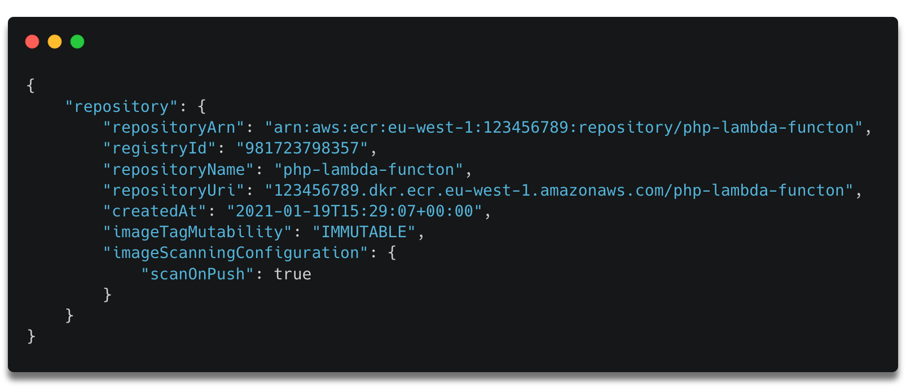
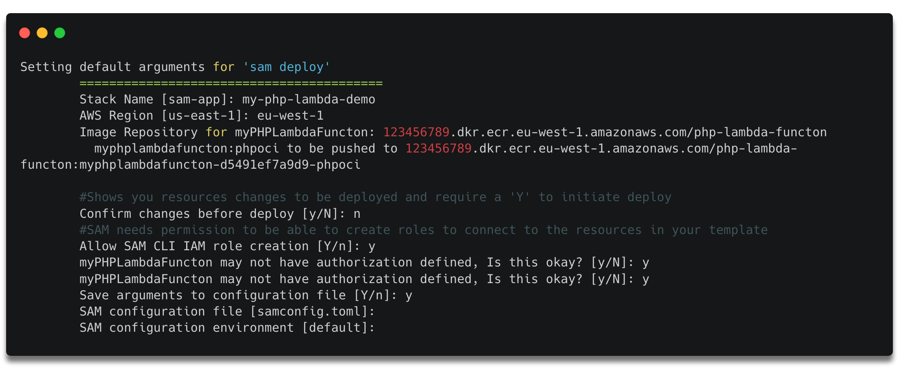
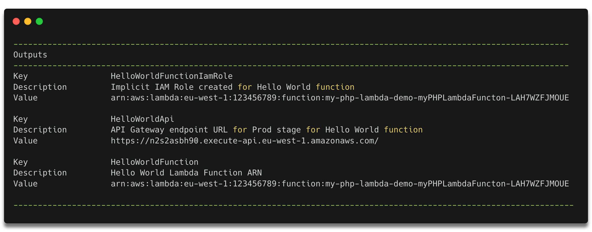

# php-lambda-container-demo

This project contains source code and supporting files for a serverless application that you can deploy with the AWS Serverless Application Model (AWS SAM) command line interface (CLI). It contains a custom runtime PHP Lambda function packaged as a docker contaier image. It deploys an Amazon HTTPs API endpoint to invoke the Lambda function. 

The following files and folders are included:

* [runtime/](./0.7-PHP-Lambda-functions-with-Docker-container-images/runtime), code for the custom runtime bootstrap file
  * [bootstrap](./0.7-PHP-Lambda-functions-with-Docker-container-images/runtime/bootstrap), a custom bootstrap file implementing the Lambda Runtime API.
* [src/](./0.7-PHP-Lambda-functions-with-Docker-container-images/src), code for the application's Lambda function.
  * [index.php](./0.7-PHP-Lambda-functions-with-Docker-container-images/src/index.php), a PHP Lambda function handler
* [Dockerfile](./0.7-PHP-Lambda-functions-with-Docker-container-images/Dockerfile), a docker file containg commands to assemble an image for a custom Lambda runtime for PHP
* [readme.md](./0.7-PHP-Lambda-functions-with-Docker-container-images/readme.md) This file.
* [teamplte.yaml](./0.7-PHP-Lambda-functions-with-Docker-container-images/template.yaml) The application AWS SAM (serverless application model) template.


## Testing locally
1.	Build the previous custom runtime image using the Docker build command:
```bash 
docker build -t phpmyfuntion .
```

2. Run the function locally using the Docker run command, bound to port 9000:
```bash 
docker run -p 9000:8080 phpmyfuntion:latest
```

3. This command starts up a local endpoint at `localhost:9000/2015-03-31/functions/function/invocations`


4.	Post an event to this endpoint using a curl command. The Lambda function payload is provided by using the -d flag.  This is a valid Json object required by the Runtime Interface Emulator:

```bash 
curl "http://localhost:9000/2015-03-31/functions/function/invocations" -d '{"queryStringParameters": {"name":"Ben"}}'
```

5. A 200 status response is returned:


## Deploy the sample application

The AWS SAM CLI is an extension of the AWS CLI that adds functionality for building and testing Lambda applications. It uses Docker to run your functions in an Amazon Linux environment that matches Lambda. It can also emulate your application's build environment and API.

To use the AWS SAM CLI, you need the following tools:

* AWS SAM CLI - [Install the AWS SAM CLI](https://docs.aws.amazon.com/serverless-application-model/latest/developerguide/serverless-sam-cli-install.html).
* Docker - [Install Docker community edition](https://hub.docker.com/search/?type=edition&offering=community).

This [Dockerfile](./0.7-PHP-Lambda-functions-with-Docker-container-images/Dockerfile),) uses the base image for Amazon Linux provided by AWS. The instructions perform the following:

1.	Install system-wide Linux packages (zip, curl, tar).
1.	Download and compile PHP.
1.	Download and install composer dependency manager and dependencies.
1.	Move PHP binaries, bootstrap, and vendor dependencies into a directory that Lambda can read from.
1.	Set the container entrypoint.


## Deploy the sample application

1. Use the AWS CLI to create a new ECR repository to store the container image for the phpLambdaFuncton.

```bash
aws ecr create-repository --repository-name php-lambda-functon \
--image-tag-mutability IMMUTABLE --image-scanning-configuration scanOnPush=true
```


Make a note of the repositoryUri as you need it in the next step.

2. Authenticate the Docker CLI to your Amazon ECR registry.

``` bash 
aws ecr get-login-password --region {region} | docker login --username AWS --password-stdin {yourAccountID}.dkr.ecr.{region} .amazonaws.com    
```
3. Build the application locally
```bash 
sam build
```

4. Use the guided version of the sam deploy command and follow these steps:

```bash
sam deploy -g
```
* For Stack Name, enter my-php-lambda-container-demo.
* Choose the same Region that you created the ECR repository in.
* Enter the Image Repository for the HelloWorldFunction (this is the repositoryUri of the ECR repository).
* For Confirm changes before deploy and Allow SAM CLI IAM role creation, keep the defaults.
* For HelloWorldFunction may not have authorization defined, Is this okay? Select Y.
* Keep the defaults for the remaining prompts:


5. The output displays the HTTP APIs endpoint url:
    

6. Send a POST request to the endpoint URL to invoke the Lambda function:
```bash
curl "https://n2s2asbh90.execute-api.eu-west-1.amazonaws.com" -d '{"queryStringParameters": {"name":"Ben"}}'
```


## Cleanup

To delete the sample application that you created, use the AWS CLI. Assuming you used your project name for the stack name, you can run the following:

```bash
aws cloudformation delete-stack --stack-name my-php-lambda-container-demo
```

## Resources

For an introduction to the AWS SAM specification, the AWS SAM CLI, and serverless application concepts, see the [AWS SAM Developer Guide](https://docs.aws.amazon.com/serverless-application-model/latest/developerguide/what-is-sam.html).
Next, you can use the AWS Serverless Application Repository to deploy ready-to-use apps that go beyond Hello World samples and learn how authors developed their applications. For more information, see the [AWS Serverless Application Repository main page](https://aws.amazon.com/serverless/serverlessrepo/) and the [AWS Serverless Application Repository Developer Guide](https://docs.aws.amazon.com/serverlessrepo/latest/devguide/what-is-serverlessrepo.html).
